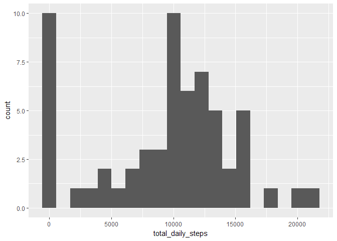
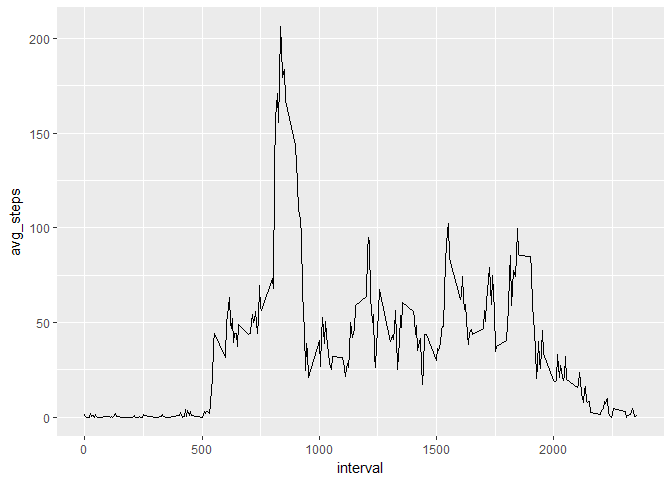
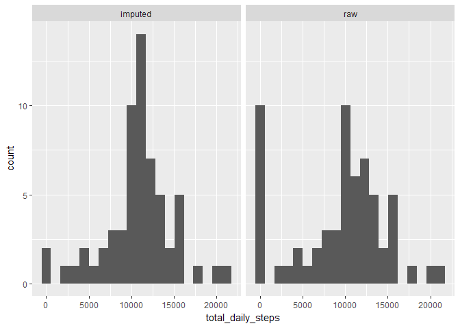
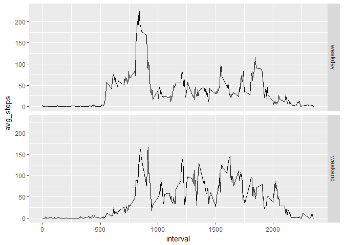

## Loading packages
This document will use dplyr, tidyr and ggplot2. It is therefore easiest to
simply import the tidyverse, which contains all of them.


```r
options(warn=-1)
library(tidyverse)
```

```
## -- Attaching packages ----------------------------------------------------------------------------------------- tidyverse 1.2.1 --
```

```
## v ggplot2 2.2.1     v purrr   0.2.4
## v tibble  1.4.2     v dplyr   0.7.4
## v tidyr   0.8.0     v stringr 1.3.0
## v readr   1.1.1     v forcats 0.3.0
```

```
## -- Conflicts -------------------------------------------------------------------------------------------- tidyverse_conflicts() --
## x dplyr::filter() masks stats::filter()
## x dplyr::lag()    masks stats::lag()
```

## Loading and preprocessing the data

As a first step the data is extracted and read
into a dataframe. It is also converted into a
tibble to take advantage of the nicer and more informative print format.


```r
unzip('activity.zip',exdir = '.')
activity <- read.csv('activity.csv') %>%
  as_tibble()
print(activity)
```

```
## # A tibble: 17,568 x 3
##    steps date       interval
##    <int> <fct>         <int>
##  1    NA 2012-10-01        0
##  2    NA 2012-10-01        5
##  3    NA 2012-10-01       10
##  4    NA 2012-10-01       15
##  5    NA 2012-10-01       20
##  6    NA 2012-10-01       25
##  7    NA 2012-10-01       30
##  8    NA 2012-10-01       35
##  9    NA 2012-10-01       40
## 10    NA 2012-10-01       45
## # ... with 17,558 more rows
```
This gives a good overview over the data. One notices that the dates are
currently represented as factors. Since they will only be used for grouping
in the first few tasks this is fine for now and they'll be converted to
a date datatype when needed.


## What is mean total number of steps taken per day?

Here the data ist first aggregated on a daily basis using
dplyr functionality.


```r
daily_steps <- activity %>%
  group_by(date) %>%
  summarise(total_daily_steps = sum(steps,na.rm=TRUE))
```
 
The resulting datafram is then use to make a simple histogram using ggplot's
qplot function, which is most convenient for simple plots
 

```r
qplot(total_daily_steps,data = daily_steps,geom='histogram',bins=20)
```

<!-- -->
One notices the large peak clos to zero, which does not seem to fit into the
distrubution so well. Its origin will become clear when imputing data later on.


Finally the data is aggregated again to obtain the mean and median of
the steps.


```r
daily_steps %>%
  summarise(mean_total_steps = mean(total_daily_steps),
            median_total_steps = median(total_daily_steps))
```

```
## # A tibble: 1 x 2
##   mean_total_steps median_total_steps
##              <dbl>              <int>
## 1            9354.              10395
```


## What is the average daily activity pattern?

Similar to the previous section the data is aggregate, this time with respect
to the interval, and then visualized with qplot.


```r
daily_pattern <- activity %>%
  group_by(interval) %>%
  summarize(avg_steps = mean(steps,na.rm=TRUE))

qplot(x=interval,y=avg_steps,data=daily_pattern,geom = 'line')
```

<!-- -->

Afterwards the interval with the maximum amount of steps is determined by
first adding a column containng that maximum and then filteren out the cases
where this maximum is realized.


```r
daily_pattern %>%
  mutate(max_avg_steps = max(avg_steps)) %>%
  filter(avg_steps == max_avg_steps)
```

```
## # A tibble: 1 x 3
##   interval avg_steps max_avg_steps
##      <int>     <dbl>         <dbl>
## 1      835      206.          206.
```


## Imputing missing values

First it is important to get an overview of the missing values
which can easily be done using


```r
colSums(is.na(activity))
```

```
##    steps     date interval 
##     2304        0        0
```

This shows that there is only step information missing and both the date column
and the interval column are complete. Therefore either of
these columns can be used to match imputed data. In this document the interval
column is used to match data for imputation. Therefore the `daily_pattern` is
joined to the activity data. A left join is used as a precaution in order
to avoid loosing any rows in the original data.
Missing values are then filled with the rounded averages of the intervals across
all days.


```r
imputed_steps <- activity %>% 
  left_join(daily_pattern,by='interval') %>%
  mutate(imputed_steps = coalesce(steps,as.integer(round(avg_steps,0))))%>%
  select(steps,imputed_steps,date,interval)
```

To check that the imputation worked one can print the number of na values again.


```r
colSums(is.na(imputed_steps))
```

```
##         steps imputed_steps          date      interval 
##          2304             0             0             0
```

This shows that the imputation was successfull. With the imputed data
the first analysis across days is repeated. In order to get an impression
of the effect of imputation the *imputed* data is analyzed along with the
unimputed *raw* data. Aggregates are for both are calculated and plotted.


```r
daily_steps_with_imputations <- imputed_steps %>%
  group_by(date) %>%
  summarise(raw = sum(steps,na.rm=TRUE),
            imputed = sum(imputed_steps)) %>%
  gather(data_type,total_daily_steps,raw,imputed)
  
ggplot(daily_steps_with_imputations) +
      geom_histogram(aes(total_daily_steps),bins=20) + facet_grid(.~data_type)
```

<!-- -->

```r
daily_steps_with_imputations %>%
  group_by(data_type) %>%
  summarise(mean_total_steps = mean(total_daily_steps),
            median_total_steps = median(total_daily_steps))
```

```
## # A tibble: 2 x 3
##   data_type mean_total_steps median_total_steps
##   <chr>                <dbl>              <int>
## 1 imputed             10766.              10762
## 2 raw                  9354.              10395
```

This shows that imputation had a major impact on the distribution decreasing
the number of days with small counts and increasing the number of days in the
middle of the distribution. The mean and median also moved a lot closer together
indicating that the imputed distribution is a lot less skewed than the raw
one.


## Are there differences in activity patterns between weekdays and weekends?

In this section a weekday analysis is performed. In order to make it 
reproducable on different computers a specific language setting is set first.


```r
Sys.setenv(LANG = "en")
```

This ensures that the weekdays' names can be reliably matched in english and
don't depend on the computer's language settings.

The weekday abbriviations are used to create a weekday/weekend factor. This
factor is then used to generate a facet plot.


```r
interval_averages_by_weekday <-imputed_steps %>% 
  as_tibble() %>%
  mutate(weekday= weekdays(as.Date(date),abbreviate = TRUE),
         weekend = factor(if_else(weekday %in% c("Sa","So"),'weekend','weekday'))) %>%
  select(-weekday) %>%
  group_by(interval,weekend) %>%
  summarise(avg_steps = mean(imputed_steps))

ggplot(interval_averages_by_weekday) +
  geom_line(aes(x=interval,y=avg_steps)) +
  facet_grid(weekend~.)
```

<!-- -->

In this plot it can clearly be seen, that the daily pattern differs between
weekdays and weekends.
